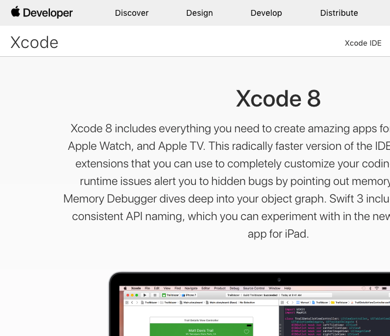

# xcode-readme

Are you sad when you see [Xcode](https://developer.apple.com/xcode/) spelled xCode in a README? :sob:

Don't be sad, just `xcode-readme` it! :smile:

```
$ bundle exec xcode-readme https://github.com/rnpm/rnpm

Checking rnpm/rnpm ...
Whoa look how they wrote "Xcode" 🔴
1. Why? Tooling is important. We all know this. One of the biggest advantages of native iOS development is XCode and its great tools. Unfortunately, the process of adding native dependencies to React Native projects is far from perfect and our aim is to make it fun again.
Open pull request? (y/n) y
Forking to ReadmeCritic/rnpm ...
Committing change...
Opening pull request...
Done: https://github.com/rnpm/rnpm/pull/94
```

`xcode-readme` uses [`readme-correct`](https://github.com/dkhamsing/readme-correct).

### ~~xCode~~ ~~XCode~~

https://developer.apple.com/xcode/

> [](https://developer.apple.com/xcode/)

## Installation

```shell
$ git clone https://github.com/dkhamsing/xcode-readme.git
$ cd xcode-readme/
$ bundle install
```

This project requires GitHub credentials in [.netrc](https://github.com/octokit/octokit.rb#using-a-netrc-file).

## Examples

Below are diffs for pull requests created with `xcode-readme` (see more  [examples](https://github.com/issues?utf8=✓&q=xcode+author%3AReadmeCritic)).

https://github.com/rnpm/rnpm/pull/94

```diff

 ## Rationale

-Why? Tooling is important. We all know this. One of the biggest advantages of native iOS development is XCode and its great tools. Unfortunately, the process of adding native dependencies to React Native projects is far from perfect and our aim is to make it fun again.
+Why? Tooling is important. We all know this. One of the biggest advantages of native iOS development is Xcode and its great tools. Unfortunately, the process of adding native dependencies to React Native projects is far from perfect and our aim is to make it fun again.
```

https://github.com/FutureKit/FutureKit/pull/36

```diff
 FutureKit uses Swift generic classes, to allow you to easily deal with asynchronous/multi-threaded issues when coding for iOS or OSX.

-- is 100% Swift.  It ONLY currently supports Swift 2.0 and XCode 7+.  Swift 1.2 branch wont be supported anymore. (Too many issues with generics made swift 1.2 less than perfect)  We are also only supporting swift 2.0+ compatble SDKs (iOS 8.0+, OSX 10.x.)
+- is 100% Swift.  It ONLY currently supports Swift 2.0 and Xcode 7+.  Swift 1.2 branch wont be supported anymore. (Too many issues with generics made swift 1.2 less than perfect)  We are also only supporting swift 2.0+ compatble SDKs (iOS 8.0+, OSX 10.x.)

 - is type safe.  It uses Swift Generics classes that can automatically infer the type you wish to return from asynchronous logic.  And supports both value and reference Swift types (Both 'Any' types, and 'AnyObject/NSObject' types.)

-- works well editing code within XCode auto-completion.  The combination of type-inference and code-completion makes FutureKit coding fast and easy.
+- works well editing code within Xcode auto-completion.  The combination of type-inference and code-completion makes FutureKit coding fast and easy.

 # Documentation

-FutureKit documentation is being written as XCode Playgrounds.  The best way to start is to open the FutureKit.workspace and then opening the Playground inside.  (If you open the Playgrounds outside of the workspace, then FutureKit module may not import correctly).
-The XCode Playgrounds probably require XCode 6.3 (in order to see the Markup correctly)
+FutureKit documentation is being written as Xcode Playgrounds.  The best way to start is to open the FutureKit.workspace and then opening the Playground inside.  (If you open the Playgrounds outside of the workspace, then FutureKit module may not import correctly).
+The Xcode Playgrounds probably require Xcode 6.3 (in order to see the Markup correctly)

-If you are impatient, or not near your copy of XCode, you can try to read the first intro "raw" playground here:
+If you are impatient, or not near your copy of Xcode, you can try to read the first intro "raw" playground here:
```

https://github.com/atelierdumobile/AppXperienceFramework/pull/1

```diff
 ### Pod Installation (recommended)

 The recommended way of installation is via [CocoaPods](http://cocoapods.org).
-Pods lets you download and integrate Appxperience in your xCode project in less than 1 minute.  
+Pods lets you download and integrate Appxperience in your Xcode project in less than 1 minute.
```

## Contact

- [github.com/dkhamsing](https://github.com/dkhamsing)
- [twitter.com/dkhamsing](https://twitter.com/dkhamsing)

## License

This project is available under the MIT license. See the [LICENSE](LICENSE) file for more info.
